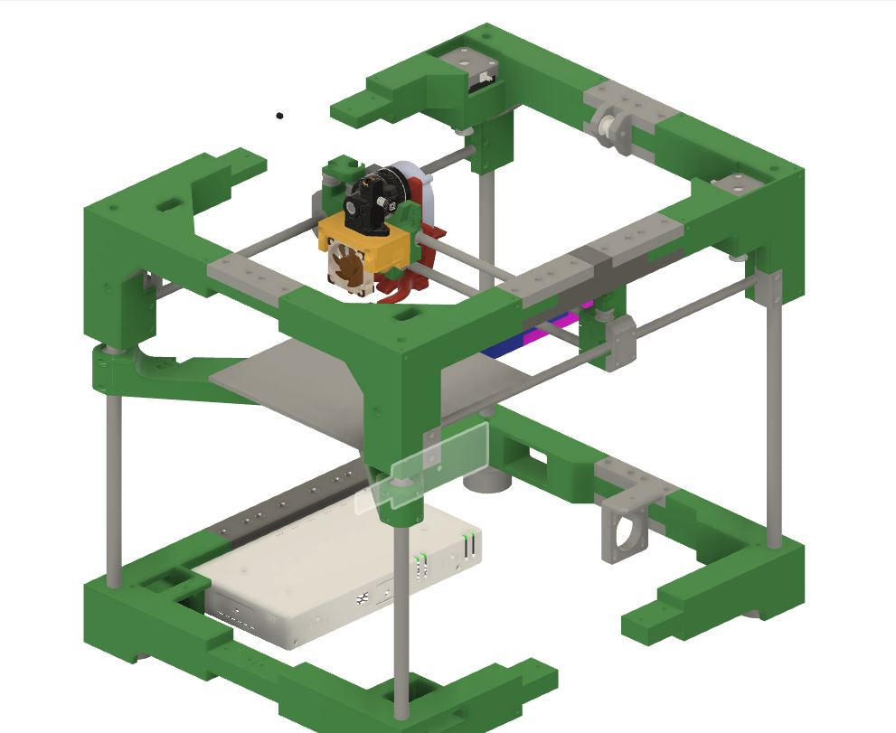
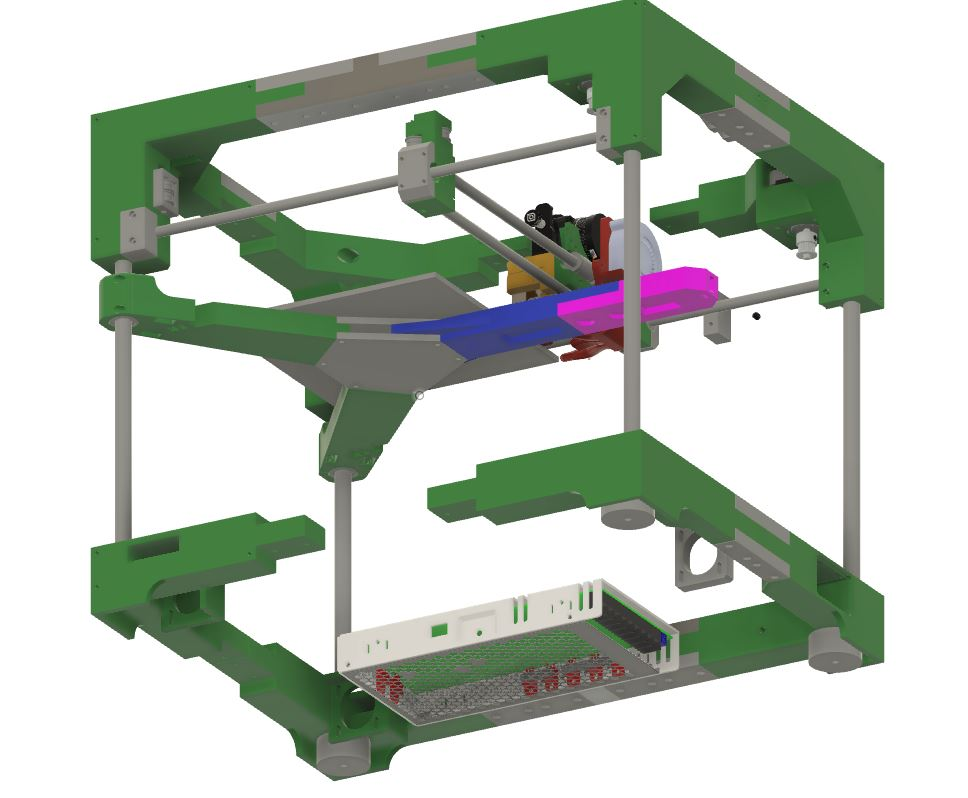
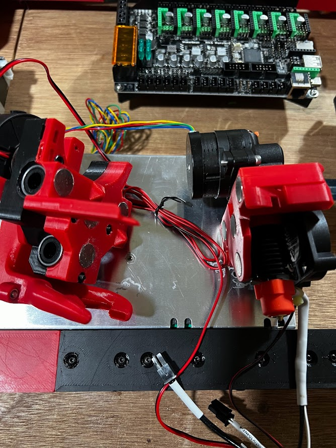
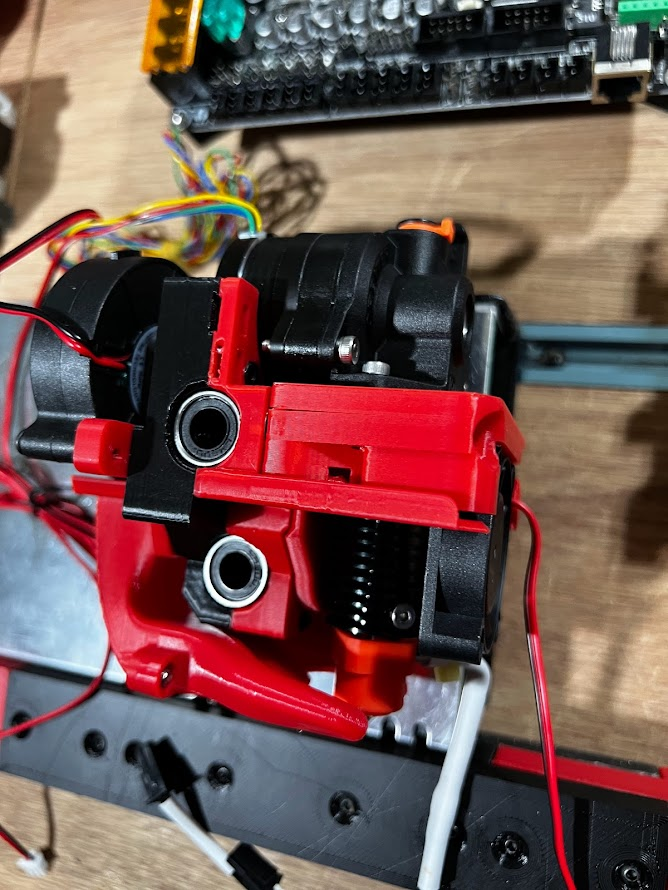
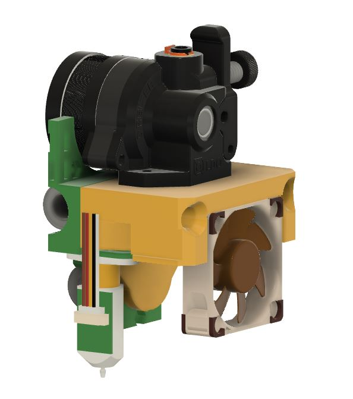
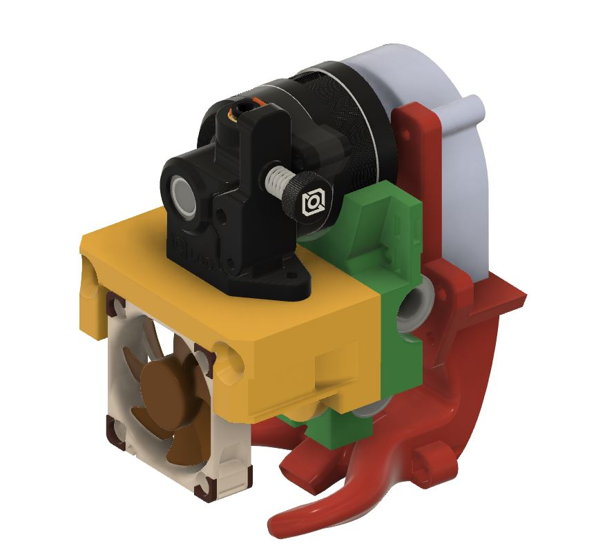
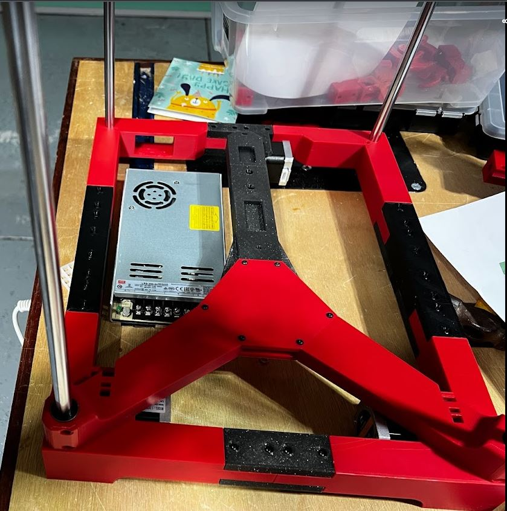
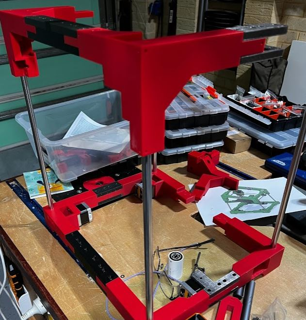
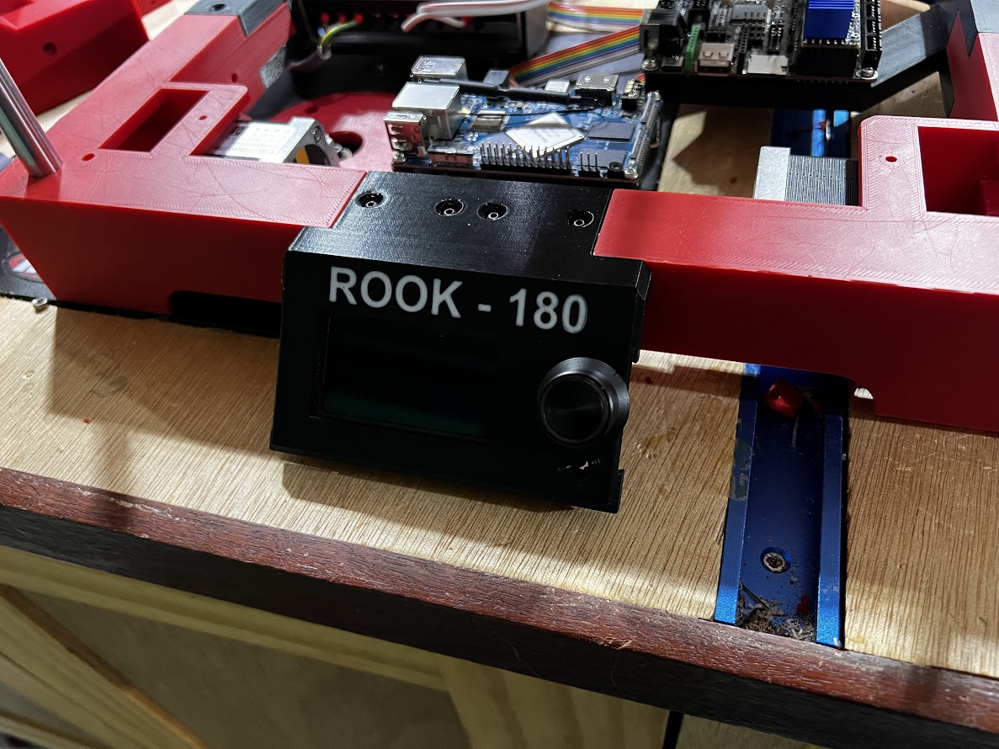
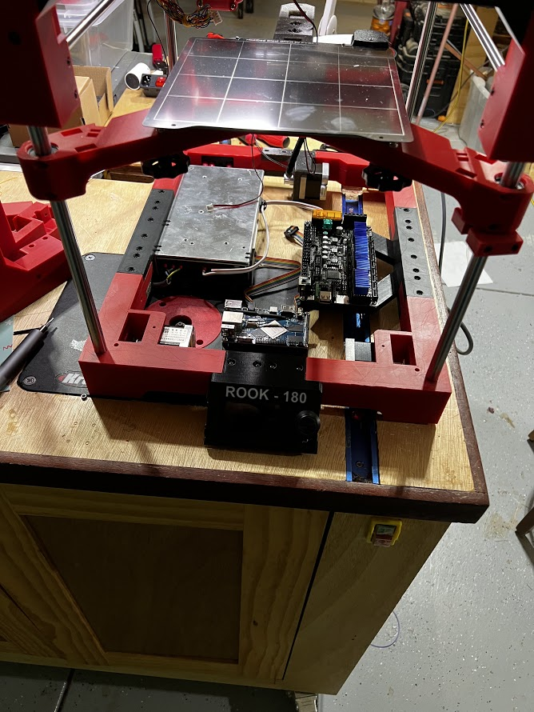

# ROOK-180 - mods by robandwend (Robertg)

## THIS IS A WORK IN PROGRESS - CHANGES ARE LIKELY

## PLAN

My plan is to build a Rook-180, extended in the Y by 100mm to allow room for 3 hotends (either 3 TD6S's or 4 if I use the Bambu hotends and bowden again) that are give me multi-filament printing.

The bed will still be 180x180, slightly further back (10mm) due to the hotend being rotated 180°. This rotation lets it be driven to the back, where a pair of clips will clip on, and allow the hotend to detatched. The clips on the rear being opened/closed by a strong servo. The hotends will rest on two spikes that fit into the holes on the hotend. (Hopefully this explanation it will make sense as I post more photos). 

Each hotend will need it's own wiring, and will carry the power for the cooling fan. The cooling fan and probe will remain on the X-Carriage, power/cables being passed to it from the removable front.

The hotend design is almost finished - see images. This required squeezing in the magnets, and some position-locking pyramids, I've weight tested the design using simple blocks with the magnets/pyramids and weights etc, and the connection appears very stable and strong. 

The design required me to add 4mm to the front length of the hotend and reducing the rear by 4 - thus keeping the part cooling correctly positioned.

I've also had to move the probe back very close to the X rods ** DESIGN NOLONGER HAS THIS CHANGE ** , to allow it to remain with the gantry when the hotends switch. One final thing I need to do is slightly modify the left part cooling pipework to correctly go around the probe.

Here's the current status...

# 12864

Also created a 12864 Display Bracket that fits as a replacement front top brace.

This is not specific to the extended 180

# MKS MONSTER8 Mount

This mount is specific to the extended 180, and replaces both the middle lower right braces, extending out to mount the Monster8.

A similar mount it available for an Orange PI 4 LTS based off the front middle brace - as seen in photo below.

